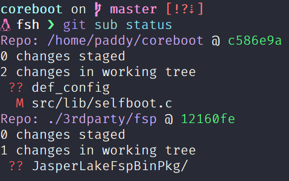
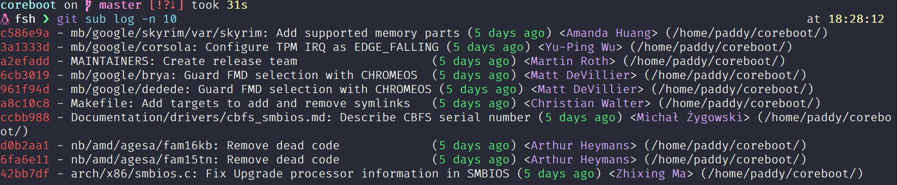

# git-sub

A command line tool to collect information across all git submodules  

## Subcommands

### status
Show submodules status and file changes  

```
Collect status information across all submodules

Usage: git-sub status [OPTIONS] [pathspec]

Arguments:
  [pathspec]  Filter commits by the pathspec

Options:
  -S, --staged                     Only show staged changes
  -w, --work-tree                  Only show working tree changes (un-staged)
  -i, --ignored                    Include ignored files
  -f, --diff-filter <diff-filter>  Filter changes with it's status.
                                   A = Add, D = Delete, M = Modified, R = Rename,
                                   T = Type changed, U = Unknown
                                   lowercases will exclude those flags
  -s, --short                      Only show summary of dirty submodules
  -p, --patch                      Show patch
  -a, --all                        Show all submodules regardless it is dirty or not
  -h, --help                       Print help information
```
### log
Search commits across all submodules  

```
Collect and show log across all submodules

Usage: git-sub log [OPTIONS] [pathspec]...

Arguments:
  [pathspec]...  Filter commits by the pathspec

Options:
  -a, --all                  Search commits on all branch
      --author <author>      Filter commits by author
  -r, --revision <revision>  Filter commits starting from the specific reference of the root repo
      --grep <grep>          Filter commits by commit message
  -l, --list                 List file of each commit
  -f, --full                 Show long format of each commit
  -p, --patch                Show patch of each commit
  -n, --num <num>            Set the number of log to be displayed
  -s, --start <start>        Set the number of log to start to displayed
  -h, --help                 Print help information
```

### status
List files across all submodules  

```
List files across all submodules

Usage: git-sub ls-files [OPTIONS] [pathspec]...

Arguments:
  [pathspec]...  Filter files by the pathspec

Options:
  -s, --staged          List files in the index
  -r, --rev <revision>  Search commits starting from the specific reference of the **root** repo
  -h, --help            Print help information
```

## Build
Install rust toolchain: https://rustup.rs  
Then run `cargo build --release`  